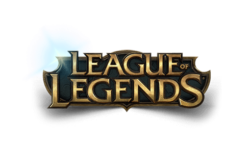

# League of Legends-Source

- [Índice](#índice)
- [Objetivos de la aplicación](#objetivos-de-la-aplicación)
- [Prototipado en papel](#prototipado-en-papel)

***

## Indice

League of Legends-Source es una aplicaión dirigida a aquellas usuarios nuevos en unos de los juegos **mmás famosos** en el mundo : **League of Legends**.

En está aplicación podrá encontrar todos los personajes (Campeones) que incluye el juego, y filtrar a los que sean de su interés.

## Objetivos de la aplicación

Brindar a los nuevos juegadores información basta para que pueda estudiar las características de los personajes y así poder tener una idea clara en aquel aspecto.

## Prototipado en papel

### Creadoras
- Rita Gómez
- Gabriela Ignacio

#