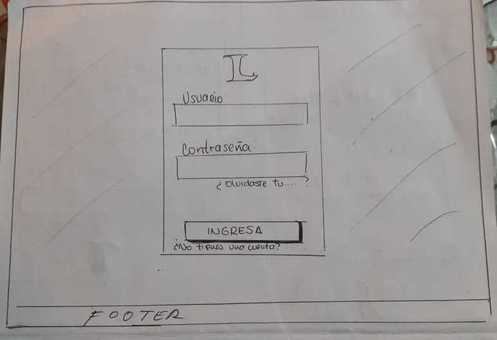
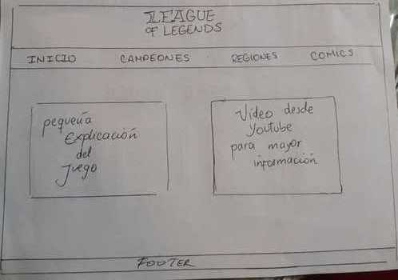
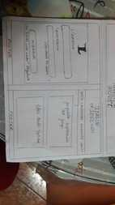
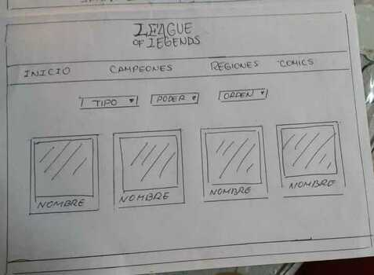
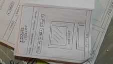
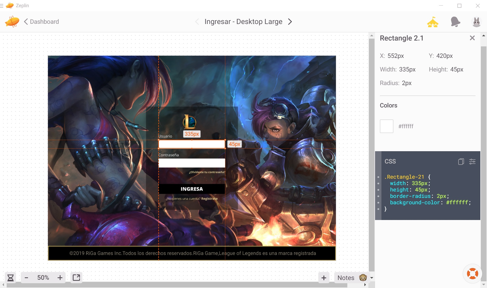

# League of Legends-Source

- [Índice](#índice)
- [Objetivos de la aplicación](#objetivos-de-la-aplicación)
- [Prototipado en papel](#prototipado-en-papel)
- [Feedbacks](#Feedbacks)

***

## Indice

League of Legends-Source es una aplicaión dirigida a aquellas usuarios nuevos en unos de los juegos **más famosos** en el mundo : **League of Legends**.

En está aplicación podrá encontrar todos los personajes (Campeones) que incluye el juego, y filtrar a los que sean de su interés.

## Objetivos de la aplicación

Brindar a los nuevos juegadores información básica para que pueda estudiar las características de los personajes y así poder tener una idea clara en aquel aspecto. 
***

## Feedbacks

### Primer Sprint :
Para entonces, menos del 50% del prototipo estaba plasmado y/o codeado, por lo tanto no tuvimos muchos comentarios, pero de igual manera lo que recibios lo supimos aprovechar y tomar en cuenta.

### Segundo Sprint :
En este sprint avanzamos según lo planeado (valga la redundancia) en la planificación, sin embargo, aun faltaban más cosas que plasmar. Fuimos muy atentas con lo que nos dijeron nuestras compañeras de squad y en general.

### Tercer Sprint :
En este sprint avanzamos mucho y teniamos el 90% del proyecto hecho por lo tanto teniamos más feedbacks de parte de todas nuestras compañeras, lo recibimos con todo el respeto y lo anotamos, después planeamos hacer algunos cambios de acuerdo al feeback recibido.

## Prototipado en papel
 Después de haber llegado a un acuerdo sobre el diseño de nuestra página web tuvimos los primeros bocetos en papel y concluimos que serían tres vistas.

 - Pantalla de inicio de sesión y segunda pantalla :

 
 
 
-  Pantalla de inicio de sesión y segunda pantalla en móvil:

 

- Tercera pantalla :

- Tercera pantalla en móvil :

 
 ***

 ## Resultado final:

 Trabajamos con el CSS de acuerdo al tema elegido, asi como los contrastes necesarios de acuerdo al juego. 

  

- Link hacia zeplin para observar el prototipo completo.
https://zpl.io/bz7wQrA  
 

### Creadoras
- Rita Gómez
- Gabriela Ignacio

#